# Supercomputer simulation

## Contents

1.  [Introduction](#introduction)
2.  [Requirements Elicitation and Analysis](#requirements-elicitation-and-analysis)
3.  [Software Requirements Specification](#software-requirements-specification)
4.  [Software Design](#software-design)
5.  [Test Plan](#test-plan)
6.  [Test Results and Code Coverage](#test-results-and-code-coverage)

## Introduction

### Project Overview

This report is a combined assignment of two modules: Requirements Analysis & System
Design and Software Testing & Quality Assurance at Cranfield University. It
describes the software engineering and development processes of a super-computing
job queuing/running control system.

The software product was managed and was developed using Agile methodology and
different engineering and development.

## Requirements Elication and Analysis

This chapter identifies the requirements elicitation and analysis as well as the techniques
that were used.

For the graphical illustration of the elicitation and analysis, we will present the requirements
using UML, which uses a set of different type of diagrams.

### Requirements Elicitation

Requirements elicitation, also known as user requirements, requirement gathering
or requirements discovering, is the process of gathering, identifying, organising and
specifying information about the stakeholders and what they want to perform with
the software system, by employing different elicitation approaches.

After each stakeholder elicited, the requirements and the supporting artifacts shall
be documented and illustrated graphically. The following figure is an early schematic
representation of requirements illustrated using UML context diagram:

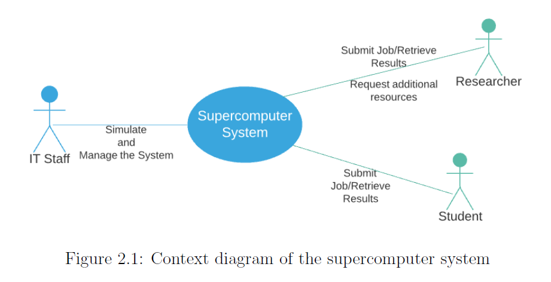

### Identifying Stakeholders

In this project, the stakeholders that have a legitimate interest in the new supercomputer
system, throughout its lifecycle, have been identified, verified, validated and
documented using use cases approach:

1. IT Staff: The IT staff are responsible of the management, maintenance and
simulation of the system. They have access to an unlimited amount of resources.
They can allocate extra resource to the researchers if needed.
Use Case: As a user of the supercomputer, they have an interest in investigating,
simulating the job queuing/submission and the operational cost of the system.

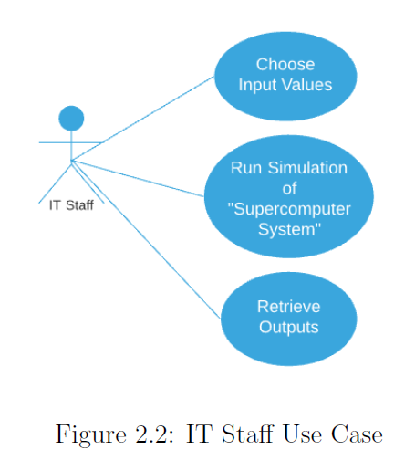

2. Researchers: Researchers are divided into groups. Each group has a different
amount of allocated resources depending of their needs. Exceptionally, individual
researchers can have access to additional resources, if needed.
Use Case: A a user of the supercomputer, they have interest to submit their
jobs and retrieve the output results.

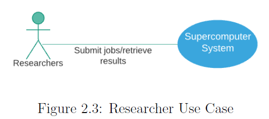

3. Students: There are different groups of students classified by the curriculum
they are enrolled in. Each curriculum has a constant amount of resources per
student, depending on the usage of the supercomputer in their course. The
resources at their disposal have both a cumulative and instantaneous maximum,
which also depends on the course.
Use Case: A a user of the supercomputer, they have interest to submit their
jobs and retrieve the output results.

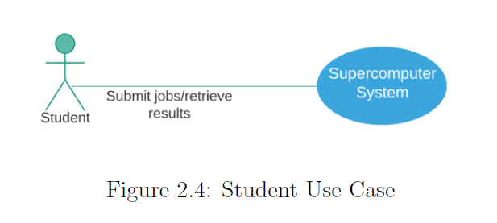

### Identifying Stakeholders’ Needs

- The stakeholders need a supercomputer system that is operational 24/7/365, which
is composed of at least 128 nodes, with at least 16 processor cores per node. In
addition, 8 nodes at least shall be equipped with GPUs.

- Each user (researcher, student, IT staff) has a different budget. The budget is a
mean to express the amount needed for a job to run.

- Researchers have a budget suitable for their research activities, and can also request
more computational resources.

- All students have the same budget, which is smaller than the researchers’ one.

- IT staff has an unlimited budget, which means that they can run as many jobs as
they want.

- When a user submits a job, they need to specify the number of nodes needed and
the time needed to complete the job.

- The users need to run different job of different runtime length.

The system composed of the supercomputer(that has a scheduler distributing the
jobs to appropriate queues) and users (researchers and students, who submit their
jobs to run and retrieve the output results, and the IT staff, who manages and
simulates the whole system). The system is demonstrated by the following UML
use case diagram: The use case diagram is schematized as following:

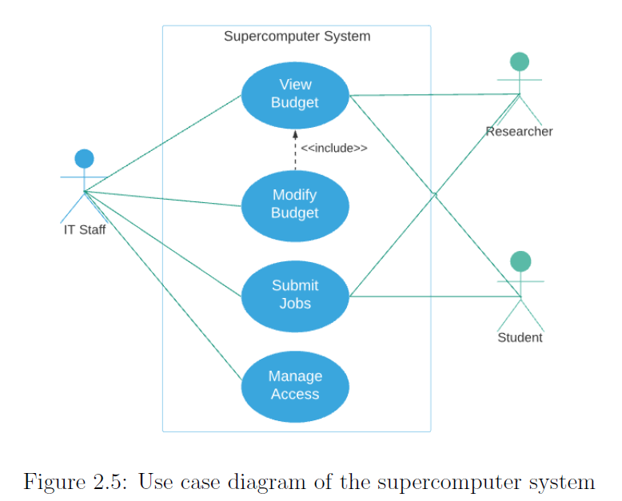

## Software Requirements Specification

### Product Scope

The software is a supercomputer control system that will be used by the IT department
of Cranfield University, to investigate and explore new job queuing/submission
and accounting strategies.

The software allows the IT staff to simulate different inputs of the system so that
it can compute the outputs accordingly. The simulation software shall be reliable,
efficient, cross-platform and easily maintainable and extensible.

### Overall Description

This product is a stand-alone software simulates a system composed of at least 128
nodes contain at least 16 cores per node. This software will provide the IT department
a tool to investigate and validate the acquisition of the new supercomputer system,
taking into account the job queuing/submission and accounting.

Regarding researchers and students, the software allows them to submit, run their
jobs and retrieve the results.

The supercomputer system offers five different job queues, in which the scheduler
manages the distribution of the jobs submitted by the simulated users, according to
the amount and type of computational resources required by each job, as well as their
runtime duration, i.e. GPU, number of cores and number of nodes, run over the
weekend, etc. at every second; and classified as follows:

• Short Jobs Queue: Theses jobs can take up to 2 nodes for an hour and 10%
of the system needs to be reserved for these jobs.

• Medium-sized Jobs Queue: They can take up to 10% of the total core count,
they can last up to 8 hours and 30% of the supercomputer need to be reserved for these jobs.

• Large Jobs Queue: These can take up to 16 hours and up to 50% of the core
count.

• GPU Jobs Queue: For jobs that require nodes equipped with them.

• Huge Jobs Queue: This queue is active from 5:00pm on Friday to 9:00am on
Monday the jobs need to be able to reserve the whole supercomputer. During
this period the other job queues are not serving any requests.

### Product Features

The IT staff shall be able to simulate different scenarios, by entering different set of
inputs:

- Number of jobs submitted by the users;

- Number of users utilising the system;

- Researcher budget, the funds available for each researcher in order to submit
a job;

- Student budget, the funds available for each student in order to submit a job;

- Submission time, the time at which the job was submitted;

- Number of traditional nodes, nodes equipped only with CPU;

- Number of accelerated nodes, nodes equipped with CPU and GPU;

- Number of cores per node;

- Ability to choose GPU-enabled nodes;

The simulation then outputs data containing:
- The number of jobs processed in each queue throughout the week;
- The actual number of nodes-hours consumed by the users;
- The utilization ratio (i.e. number of nodes-hours consumed by the users /
number of nodes-hours available);
- The average queuing time in each type of queue;
- The average turnaround time ratio (i.e. time of queuing the job to run completion
/ actual job runtime);
- The monetary balance of the operating centre;

The system has three active actors: the researchers and students who submit jobs for
execution and retrieve the outputs; and the IT staff who manages the job queuing/-
submission system and the users. The system is also composed of the supercomputer
and a scheduler, that distributes the jobs to appropriate queues, which are both
simulated by the IT staff. Figure 3.1 is a schematic illustration of the system’s environment.

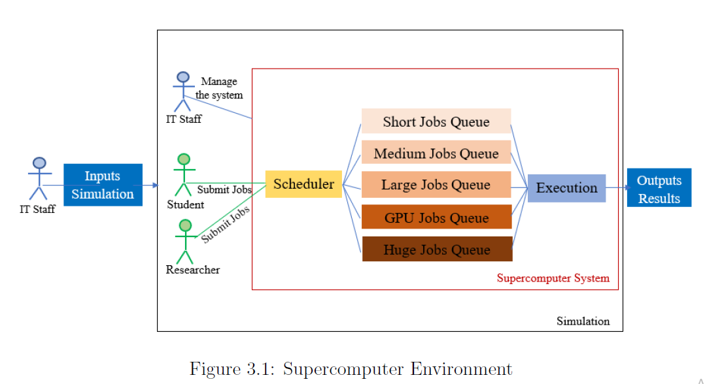

### Functional Requirements Specifications

The functional requirements describe the software’s features. They define the software’s
behaviour: how the system will respond to different user inputs. The functional
requirements of the supercomputer system were expressed in the following table:

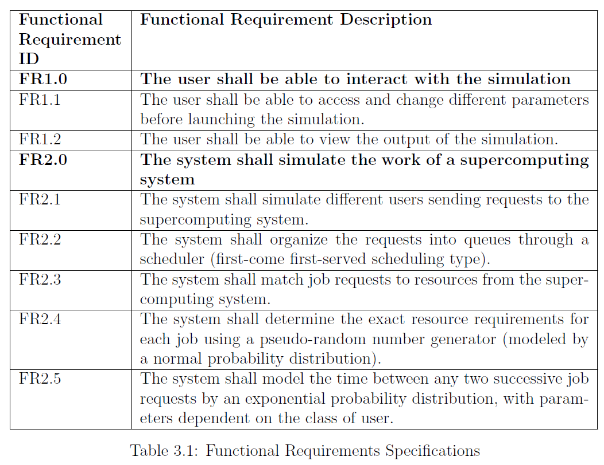

### Non Functional Requirements Specifications

Non-functional requirements serve as constraints on the design of the software and
they are critical as functional requirements, because they define the characteristics
that affect the user experience. Failing to meet one of them may lead to not fulfill
business and user needs.

This section outlines the non-functional requirements for the supercomputer simulation
system. Performance, reliability, availability, security, and maintainability
requirements are included.

1. Performance: The product shall be able to distribute the jobs to the appropriate
queues efficiently. The scheduler shall support a different group of users (IT
staff, researchers and students in this case) with different resource allocation.
Also, the product must be available 24/7/365.

2. Scalability: The developed product shall be able to accommodate future update/
maintenance without major re-engineering.

3. Usability: The product enables easy use, e.g., data input and effective outputs.

4. Reliability: The product shall be able to perform input tasks within an appropriate
amount of time with resistance to failure and allow to choose different
criteria such as budgets, number of jobs, number of users, starting date of the
execution, number of cores, etc. The scheduler shall be able to match job requests
to resources according to different uses, short, medium, long running,
with GPU, etc. The job queues should be distinguished not only on the running
time but also on the amounts of resources that can be requested by each
group of users.

5. Portability: The developed product shall be cross-platform, being able to run
on most operating system and computers.

### Assumptions and Dependencies

To develop and simulate the product, a set of assumptions and dependencies were
placed:

- Each simulation is starting a Monday at midnight.

- The IT staff users have unlimited budget.

- The IT staff users are not submitting any job.

- A student can only request a certain number of nodes.

- A researcher can only request a certain number of nodes (more than students).

- Approximately the 10/16 of users are student, 5/16 researchers and 1/16 IT
staff.

In the assignment it is written (requirement): the workload request generation shall
also take into account the job queue limits. To respect this requirement:

- Approximately 75% of the generated jobs are short jobs.

- Approximately 15% of the generated jobs are medium jobs.

- Approximately 5% of the generated jobs are large jobs.

- Approximately 9% of the generated jobs are GPU jobs.

- Approximately 1% of the generated jobs are huge jobs.

- Huge jobs are not using the GPU nodes.

- The users request nodes when submitting a job, not cores.

- Jobs that require GPU-enabled nodes can take up to 16 hours.

- Huge jobs take longer than 16 hours and they use more than 50% of the total
node count.

## Software Design

Following is a list of the different parameters/inputs that can be selected by the users
of the simulation.
- Number of users sending job execution requests to the system;

- Number of jobs sent to the system;

- Budget of each user (Students and Researchers);

- Maximum resources that a user can use;

- Cost of accelerated and traditional nodes per hour;

- Number of nodes of the computing system;

The output from the simulation should include:

- The number of jobs processed in each queue (throughput) per week;

- The actual number of node-hours consumed by user jobs;

- The resulting price paid by the users;

- The average wait time in each queue;

- The average turnaround time ratio, i.e. the time from placing the job request
to its completion divided by the actual runtime of the job;

- The economic balance of the centre, calculated by subtracting from the actual
price the operating costs;

### The Scheduler

The scheduler is based on a first-come first-served algorithm to distribute the jobs
across the different queues.

A vector of jobs is created and sorted by submission date (sorted in unsigned int),
which is described by the number of seconds counting from Monday at midnight
(00:00), and each day of the week calculated based on that.
Jobs will be generated using a random generator and will be allocated to a user,
who is randomly created. A start time will be set for each job based on a first-come
first-served algorithm (as noted earlier).

To monitor the available computational resources of the system (the state of the computational
resources), a vector of that keeps track of the resources used is created,
containing the available computational resources calculated during the job lifecycle
i.e., (at each start and end time of a job). Thus, for each job, the scheduler assigns
two new variables to this vector.

The figure 4.2 represents the state diagram of the scheduler.

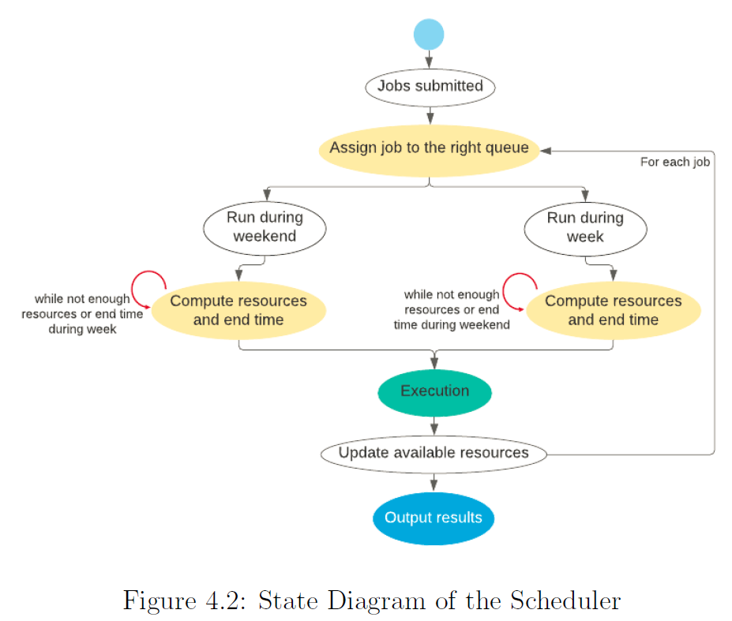

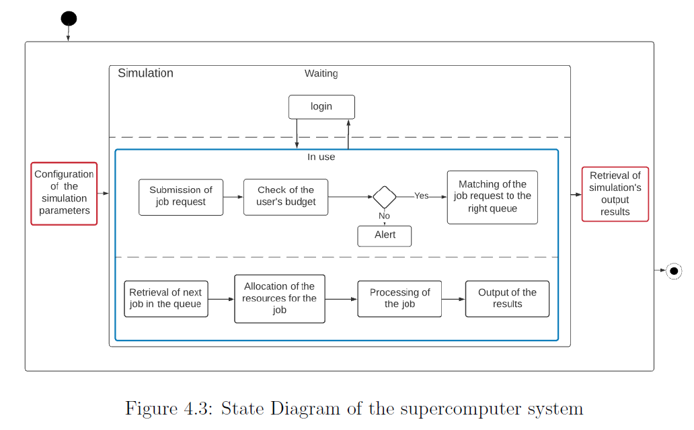

The figure 4.3 above takes into account the two scopes of the project. The first one being
the interaction between an IT staff member and a simulation of a supercomputer
being used by different users. The second scope is the inside of this supercomputer
simulation, more specifically the interaction between any user and the fictitious supercomputer.
Thus, we can see the different events generated by an IT staff member while interacting
with the simulation (red rectangles in Figure 4.3) The second type of events are
the ones happening inside the simulation once running. We used a parallel notation
(dotted line in blue rectangle in Figure 4.3) to simulate the supercomputer using a
scheduler to treat different job requests while also running other jobs.

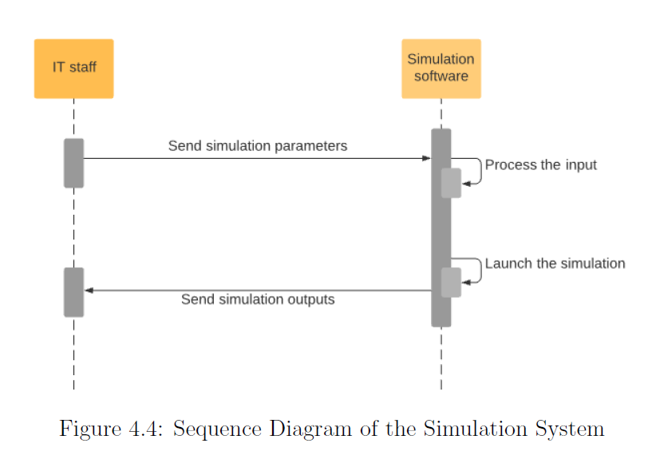

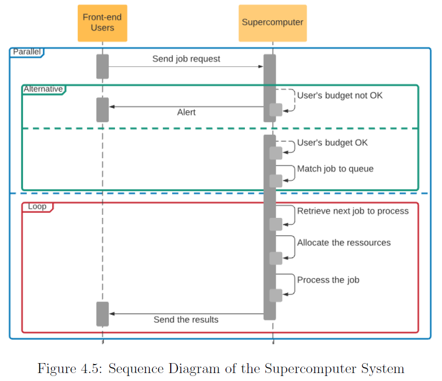

With the creation of the above diagrams, we now have a general understanding of the
different features and functions that will be implemented while building our software.
This allows us to create one final UML diagram: the class diagram. This diagram is
used as a graphical notation to construct and visualize object-oriented systems such
as the one we are building.

### System Design using Class Diagram

Each class in the diagram below serves a specific purpose:
S
- The Data class holds all the constants needed in every other class to run the
simulation.

- The Job class is used to create jobs before sending them to the scheduler.

- The User class is used to create the different users responsible for sending the
job requests.

- The NodeCount class keeps count of the resources used by every job when
running.

- The Simulation class is built to run the whole super computer simulation, from
the creation of random users and jobs (following the assignment requirements)
to the scheduler algorithm.

- The Parameters class is used to process the end-user inputs and interact with
them throughout the process.

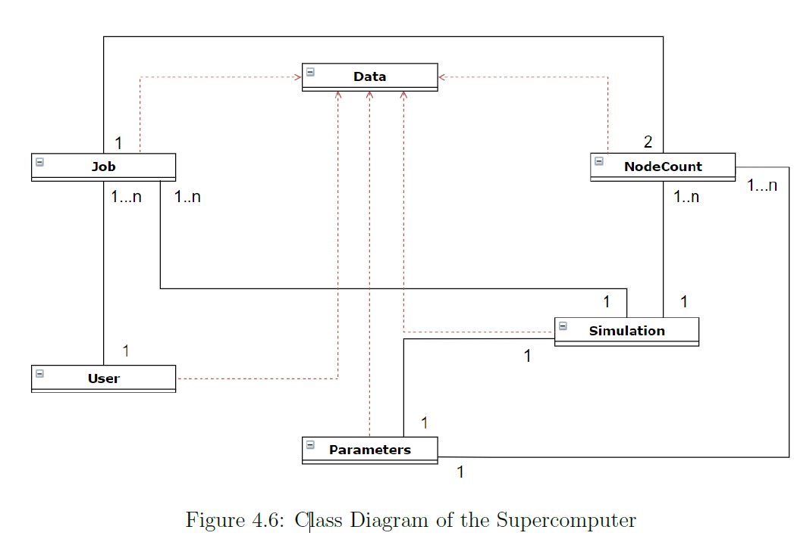
